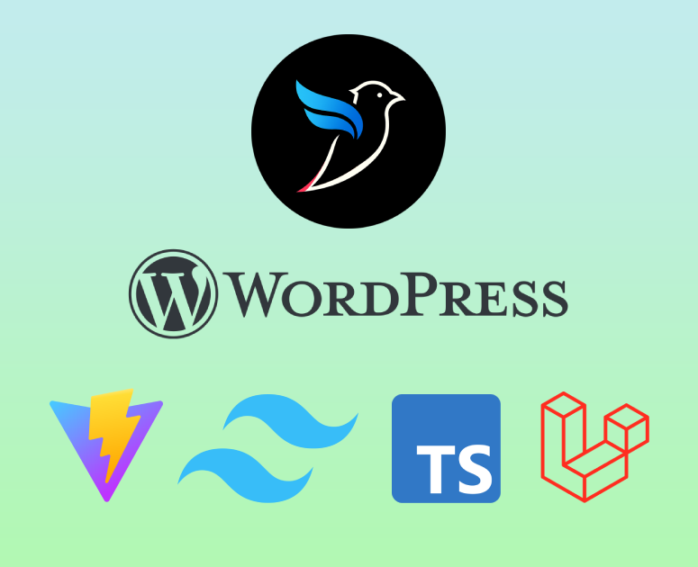

# TailBlade WP

> Logos belong to their respective owners.

TailBlade WP is a WordPress starter theme that pairs Blade templating with a modern front-end toolchain.

Composer manages PHP dependencies, Tailwind CSS handles styling, the scripts are written in TypeScript, Vite covers bundling and hot module replacement, and smooth routing & page transitions are powered by Barba.js.

## Tech Stack
- WordPress + BladeOne for templating
- Tailwind CSS, PostCSS, and Sass for styling utilities
- TypeScript + Vite for asset compilation
- Barba.js for SPA-style routing and transitions
- Composer for PHP dependencies, Yarn for Node tooling

## Getting Started
1. Install Node dependencies: `yarn`
2. Install PHP dependencies: `composer install`
3. Start the development server: `yarn dev`

Vite runs on port `5173` by default. Ensure `VITE_ENVIRONMENT_TYPE` is set to `dev` in your WordPress configuration to enable hot reloading and Barba routing during development.

## Build & Deployment
- `yarn build` – creates the production bundle in `dist/` and generates `manifest.json`
- `yarn preview` – serves the production build locally for final checks
- Deploy the `dist/` directory along with the theme files when moving to production. In production mode the manifest is read by `inc/core/vite.config.php` to enqueue hashed assets.

## Project Structure
- `functions.php` – boots BladeOne, registers helpers, and wires the Vite asset loader
- `inc/` – PHP helpers split into `core`, `helpers`, and `posts` modules
- `src/` – front-end sources
  - `scripts/core` – state management, Barba.js router, utilities, base classes
  - `scripts/modules` – reusable component logic
  - `scripts/pages` – page-level controllers
  - `styles/scss` – base styles, modules, utilities, and the `app.scss` entry
- `views/` – Blade templates organised into `layouts`, `partials`, `components`, and `pages`

## Routing & Transitions
`src/scripts/main.ts` registers pages and modules with Barba.js. Each “page” class extends the shared `Page` base (see `src/scripts/core`) and participates in navigation lifecycle hooks, allowing animated transitions and per-page logic without reloading the browser.

## Useful Notes
- ESLint (Airbnb base) runs during `yarn dev` to keep TypeScript clean.
- Tailwind configuration lives in `tailwind.config.js`; extend it as needed.
- The Blade template cache is stored in `cache/`. WordPress writes to this directory, so make sure it is writable on your server.
- Composer is configured to remove `composer.lock` on install/update to keep the theme dependency-less for distribution.
